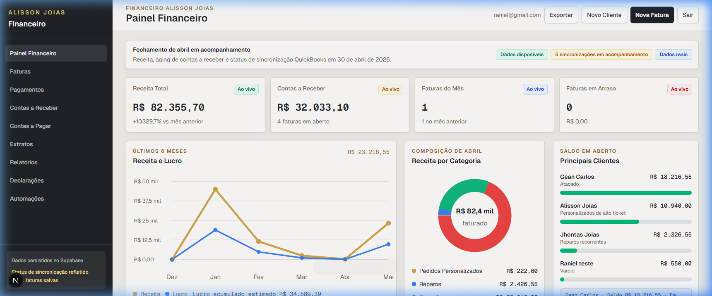
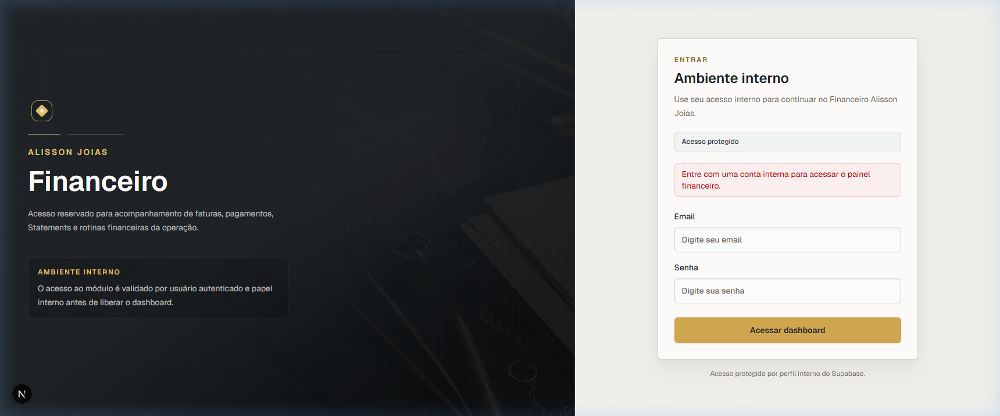
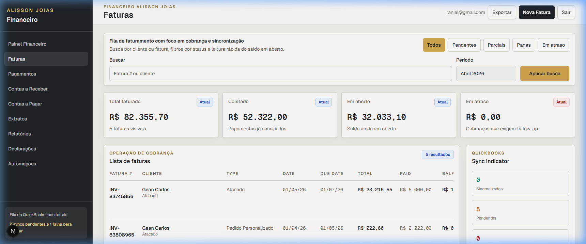

# Alisson Joias ERP - Módulo Financeiro

Este é o projeto correspondente ao teste técnico fullstack para a construção de um **Módulo Financeiro** de um ERP para joalheria, inspirado no contexto *PIRO Fusion*.

O objetivo principal do sistema é centralizar as operações financeiras da joalheria de forma segura e escalável, lidando com faturas (invoices), contas a pagar e receber, geração de extratos, relatórios de fluxo de caixa e integrações relacionadas (como mock de QuickBooks e variação do ouro). O projeto foi desenhado com um forte enfoque na **organização de código, manutenibilidade, clareza arquitetural e em uma excelente experiência do usuário**.

## Visão Geral da Aplicação

A aplicação atua como um hub centralizado para o departamento financeiro, permitindo:
- **Gestão de Invoices:** Criação, filtro e atualização de faturas com integração a PDFs.
- **Contas a Receber (AR) e Contas a Pagar (AP):** Controle de pagamentos, registro de recebimentos parciais e totais.
- **Extratos e Relatórios (Statements e Reports):** Geração e acompanhamento da saúde financeira do negócio.
- **Automações (Automations):** Interface de configuração de rotinas automáticas (mock).
- **Declarações (Declarations):** Fluxo para declarações alfandegárias de envio/recebimento de joias.

### Fluxos Principais
1. **Autenticação:** Login seguro via Supabase Auth. Apenas usuários com as *roles* corretas (`admin` ou `staff`) conseguem acesso à área restrita do painel financeiro.
2. **Dashboard:** O usuário inicia no Dashboard, onde tem acesso aos principais KPIs de saúde financeira e gráficos de fluxo de caixa da joalheria.
3. **Módulos Financeiros:** Navegação fluida para Invoices, Contas e Relatórios, utilizando as vantagens de Server Components (RSC) e Client Components (para interatividade).
4. **Armazenamento:** Os dados principais são sincronizados e guardados no **PostgreSQL** hospedado pelo **Supabase**.

---

## Screenshots

*(Imagens e telas da aplicação. Adicione os arquivos na pasta `docs/screenshots/` com os respectivos nomes).*

### Dashboard


### Login


### Financeiro


---

## Stack

- React 19
- TypeScript
- Tailwind CSS
- Supabase
- PostgreSQL
- Vercel

---

## Setup Local

### Pré-requisitos
- Node.js (v20 ou superior)
- npm (ou outro gerenciador de pacotes da sua preferência)
- Conta no [Supabase](https://supabase.com/) com um projeto configurado

### Como rodar o projeto

1. **Clonar o repositório**
   ```bash
   git clone <URL_DO_REPOSITORIO>
   cd alisson-joias-erp
   ```

2. **Instalar dependências**
   ```bash
   npm install
   ```

3. **Configurar variáveis de ambiente**
   Crie um arquivo `.env` na raiz do projeto com base no `.env.example`:
   ```bash
   cp .env.example .env
   ```
   Preencha o arquivo `.env` com suas credenciais do projeto no Supabase (não exponha keys confidenciais em repositórios públicos).

4. **Banco de Dados (Migrations/Seed)**
   As configurações e migrations base do banco encontram-se em `supabase/migrations/`. Execute-as no painel do Supabase ou utilizando a CLI oficial (ex: `supabase db push`), dependendo do seu fluxo de desenvolvimento.

5. **Iniciar o ambiente de desenvolvimento local**
   ```bash
   npm run dev
   ```

6. **Acessar a aplicação**
   Abra no seu navegador o endereço:
   [http://localhost:3000](http://localhost:3000)

---

## Variáveis de Ambiente

O arquivo `.env.example` lista as variáveis requeridas pela aplicação. As principais são:

| Variável | Descrição |
|----------|-----------|
| `NEXT_PUBLIC_SUPABASE_URL` | URL do seu projeto no Supabase |
| `NEXT_PUBLIC_SUPABASE_PUBLISHABLE_KEY` | Chave pública e segura para uso no frontend via Supabase |
| `INTERNAL_FINANCE_ALLOWED_EMAILS` | (Opcional) Lista de emails de testes autorizados no fluxo financeiro |

> **Aviso de Segurança**: Nunca faça commit de tokens sensíveis (`SERVICE_ROLE_KEY`) ou senhas de produção no repositório.

---

## Scripts Disponíveis

| Script | Descrição |
|---|---|
| `npm run dev` | Inicia o ambiente de desenvolvimento local no Next.js |
| `npm run build` | Gera a versão otimizada de produção da aplicação |
| `npm run start` | Inicia o servidor a partir da build de produção (`npm run build`) |
| `npm run lint` | Executa a análise de lint usando ESLint para checar estilo e erros de código |
| `npm test` | Executa a suite de testes nativa configurada com o Node Test Runner |

---

## Estrutura do Projeto

O código-fonte segue a arquitetura App Router do Next.js aliada à separação baseada em *Features* (Módulos de Domínio):

```txt
src/
  app/          # Roteamento central do Next.js (Pages, Layouts, API Routes)
  features/     # Componentes e lógicas de negócios isolados por domínio (invoices, dashboard, payments-accounts, etc.)
  lib/          # Funções utilitárias, configurações de libs de terceiros e integrações (Supabase client, manipulação de PDFs, etc.)
docs/           # Documentações de arquitetura, fluxos, regras de negócios e log de uso de IA
supabase/       # Migrations de banco de dados e políticas de acesso
tests/          # Arquivos e rotas para testes unitários e de integração
```

---

## Uso de Inteligência Artificial no desenvolvimento

A IA foi utilizada como ferramenta de apoio técnico e produtividade, enquanto as decisões de arquitetura, validação funcional, testes e ajustes finais foram conduzidos pelo desenvolvedor. O uso dessas ferramentas permitiu acelerar etapas operacionais e garantir uma documentação e cobertura mais ricas desde o dia 1.

- **Planejamento inicial com ChatGPT:**
  - Levantamento de requisitos e casos de uso;
  - Organização do roadmap e estruturação das tasks do projeto;
  - Apoio na escrita e formatação da documentação de pré-desenvolvimento (`docs/`).
- **Desenvolvimento assistido por agentes:**
  - Uso de agentes como Codex e Claude Code para acelerar a implementação de componentes e lógicas;
  - Geração de rascunhos para refatoração e melhoria da organização de rotas e pastas;
  - Apoio na revisão de código estático e diagnóstico durante a correção de bugs.
- **Arquitetura de agentes:**
  - Foi criado e organizado o arquivo central `AGENTS.md` na raiz do projeto;
  - Esse arquivo centraliza todas as regras de desenvolvimento, os padrões de código, o contexto da aplicação financeira para joalherias e as instruções macro para os agentes de IA;
  - Essa estratégia ajuda a manter uma alta consistência de implementação entre as sessões e previne desvios da stack técnica desejada.
- **Skills personalizadas:**
  - Foram criadas "skills" e instruções específicas na pasta `.agents/skills` para guiar os modelos ao longo das decisões arquiteturais.
  - Exemplos incluem: leitura correta de requisitos de negócio, geração padronizada de documentação técnica, revisão de código visando boas práticas do Next.js e Supabase, revisão de bugs e a própria elaboração deste README.
  - O objetivo das skills foi atuar como camadas de contexto que elevam a qualidade da entrega, reduzindo o viés probabilístico e aumentando a rastreabilidade do raciocínio.

---

## Decisões Técnicas

- **Next.js App Router**: Adoção do App Router visando facilitar as transições visuais, colocation de rotas e para obter vantagens expressivas de performance utilizando Server Components (RSC) nas consultas de dados, delegando o cliente apenas à interatividade real.
- **Supabase**: Adotado como Backend as a Service e principal infraestrutura de persistência de dados. A combinação entre banco relacional PostgreSQL e Auth via SSR fornece segurança escalável.
- **Isolamento por "Features"**: Em vez de concentrar todos os componentes sob a pasta `components/`, o código está quebrado dentro de `src/features/`. Isso melhora o isolamento das regras de domínio financeiro, evitando que módulos como "dashboard" e "invoices" se misturem e criem dependências circulares ocultas.

## Boas Práticas Adotadas

- **Componentização**: Criação de pequenas partes de UI fáceis de reutilizar, compostas e organizadas para facilitar a manutenção visual.
- **Tipagem com TypeScript**: Segurança na definição de entidades e objetos trafegados para evitar os clássicos erros de "undefined" em runtime e garantir integridade das transações financeiras.
- **Separação de Responsabilidades**: A manipulação de regras de acesso ao banco (Supabase queries) ocorre preferencialmente do lado do servidor, passando apenas as estruturas necessárias e serializadas para os Client Components.
- **Organização de rotas**: O Next.js possibilita roteamento explícito em `app/` sem vazamento de lógica de negócio em arquivos publicamente acessíveis.
- **Uso de Variáveis de Ambiente**: Arquivos como `.env` e acesso via configuração padrão asseguram proteção aos dados sensíveis do projeto.
- **Integração com banco**: Comunicação simplificada e assíncrona por meio de serviços bem encapsulados.
- **Lint e Build**: Configuração rigorosa de ESLint e checagem forte de TypeScript.
- **Versionamento com Git**: Histórico consistente de commits guiando todo o fluxo evolutivo e semântico.

## Próximos Passos

Como todo sistema escalável, o projeto mantém uma forte fundação técnica para crescer organicamente rumo a produção. Sugestões de melhorias de arquitetura:

- **Testes automatizados e cobertura:** Expandir os testes existentes para cobrir exaustivamente as lógicas de formatação de valores financeiros e a integração de chamadas E2E.
- **Observabilidade / Logs:** Implantar rastreamento centralizado de erros do lado do servidor (ex: Sentry/Datadog) para detectar incidentes no painel.
- **Melhorias de Performance:** Avaliar a política de cacheamento e uso dinâmico de Edge Functions para cálculos pesados e revalidação do fluxo de caixa sob demanda.
- **Melhorias de acessibilidade:** Refinar suporte ao uso de teclado, navegação por tabulação e uso sistemático de `aria-labels` e tags semânticas apropriadas pelo Dashboard.
- **Documentação de API:** Gerar artefatos OpenAPI / Swagger para a parte de API do projeto, facilitando testes e integrações B2B no ecossistema da joalheria.
- **CI/CD mais robusto:** Implementar rotinas na Pipeline do GitHub Actions ou Vercel para rodar migrations em ambientes efêmeros e assegurar aprovação do linter/testes antes dos deploys em homologação/produção.
